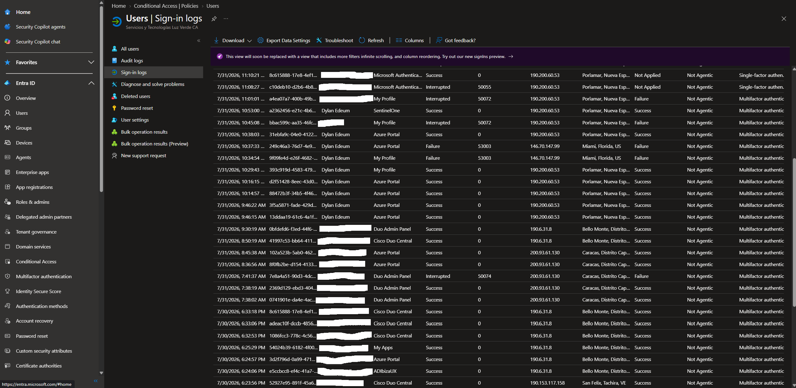
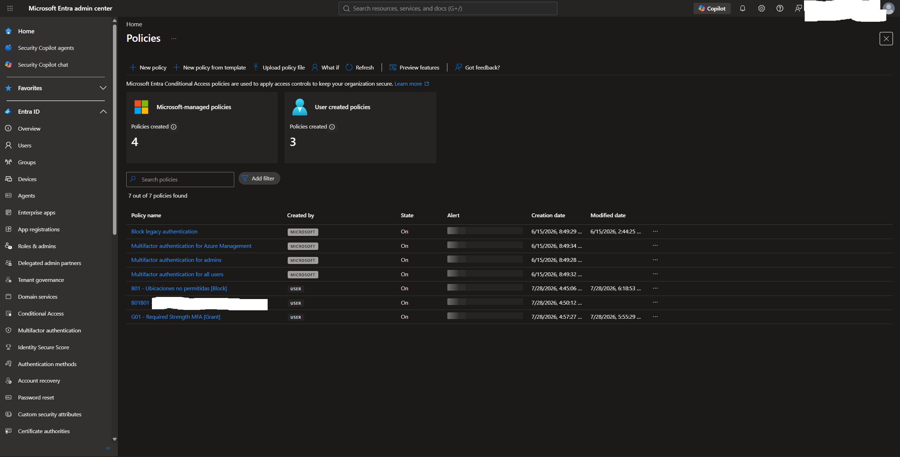
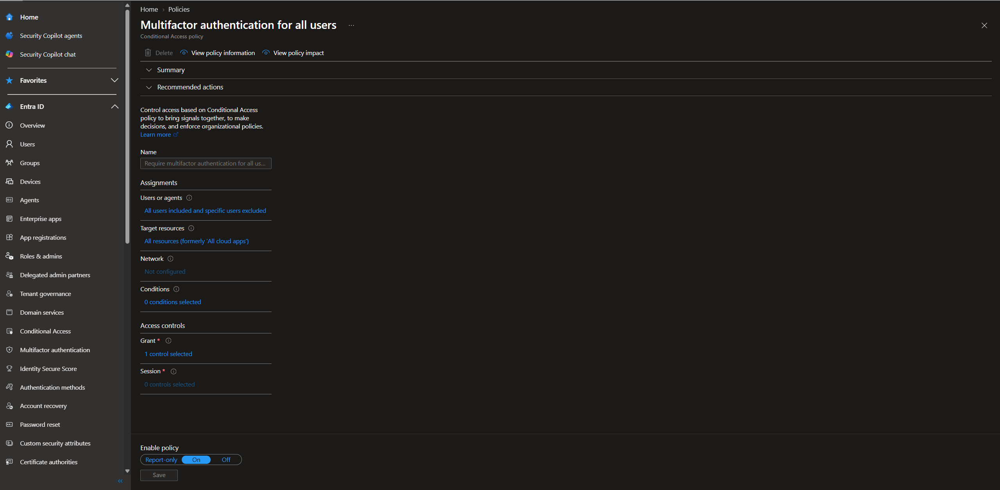
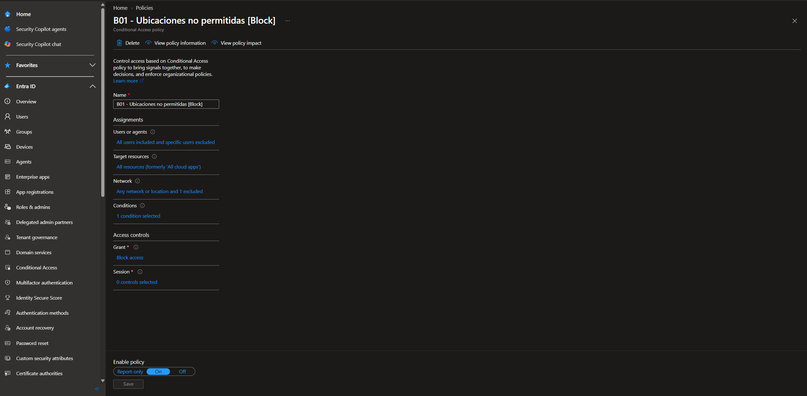
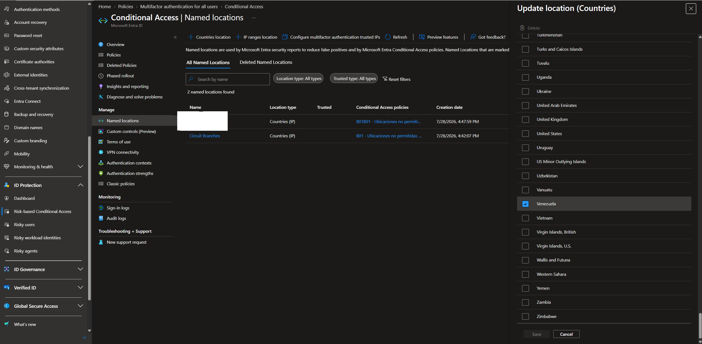
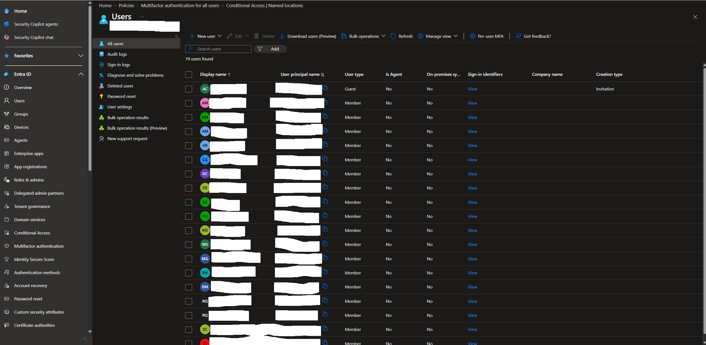

# Entra ID Hardening Guide
**Microsoft Entra ID | Identity Security | IAM Hardening**

## Objective
Document and analyze the Microsoft Entra ID security configuration 
of a production environment based on CIS Benchmark and Microsoft 
security best practices. This project demonstrates real-world 
Identity and Access Management (IAM) hardening skills including 
Conditional Access policy analysis, MFA enforcement, sign-in log 
monitoring, and location-based access controls.

**Environment:** Production tenant — Microsoft Entra ID P1  
**Tenant:** Servicios y Tecnologías Luz Verde CA (circuit.credit)  
**Role:** Global Administrator (assigned for security audit purposes)  
**Tools:** Microsoft Entra Admin Center, Conditional Access, Sign-in Logs  

---

## Environment / Architecture

| Component | Details |
|---|---|
| Identity Provider | Microsoft Entra ID (formerly Azure AD) |
| License | Microsoft Entra ID P1 |
| Users | 19 members + 1 guest |
| Conditional Access Policies | 7 active (4 Microsoft-managed, 3 user-created) |
| MFA | Enforced via Conditional Access for all users |
| Location Controls | Country-based blocking via Named Locations |

---

## Implementation Steps

### 1. Sign-in Log Analysis
Reviewed user sign-in logs to identify authentication patterns, 
geographic anomalies, and policy enforcement in action.

**Key findings:**
- Normal activity originated from **Porlamar, Nueva Esparta, VE** 
  (IP: 190.200.60.53)
- Two blocked attempts detected from **Miami, Florida, US** 
  (IP: 146.70.147.99) — Error code **53003**
- Error 53003 = access blocked by Conditional Access Policy
- Multiple applications monitored: SentinelOne, Azure Portal, 
  Cisco Duo Admin Panel, ADIbizaUX

**Security implication:** The Conditional Access location-based 
blocking policy is actively preventing unauthorized access from 
non-permitted geographic locations.

---

### 2. Conditional Access Policies — Overview
The tenant has 7 active Conditional Access policies providing 
layered identity security controls.

| Policy | Created by | State | Purpose |
|---|---|---|---|
| Block legacy authentication | Microsoft | On | Prevents legacy protocol attacks |
| MFA for Azure Management | Microsoft | On | Protects admin operations |
| MFA for admins | Microsoft | On | Secures privileged accounts |
| MFA for all users | Microsoft | On | Baseline MFA enforcement |
| B01 - Ubicaciones no permitidas | User | On | Blocks non-permitted countries |
| B01B01 - [REDACTED] | User | On | Extended location block |
| G01 - Required Strength MFA | User | On | Enforces strong MFA methods |

---

### 3. MFA Enforcement Policy — All Users
Analysis of the Microsoft-managed Conditional Access policy 
enforcing MFA across all users and all cloud applications.

**Policy configuration:**
- **Users:** All users included, specific users excluded
- **Target resources:** All resources (all cloud apps)
- **Network:** Not configured (applies globally)
- **Conditions:** 0 additional conditions
- **Access controls:** Grant — 1 control selected (Require MFA)
- **State:** On

**Security implication:** Any user attempting to access any 
cloud application must complete MFA regardless of location or 
device. This implements the Zero Trust principle of 
*"Verify explicitly"*.

---

### 4. Location-Based Access Control — B01 Block Policy
Analysis of the user-created Conditional Access policy blocking 
access from non-permitted geographic locations.

**Policy configuration:**
- **Users:** All users included, specific users excluded
- **Target resources:** All resources
- **Network:** Any network or location — 1 location excluded 
  (permitted locations)
- **Conditions:** 1 condition selected (location-based)
- **Access controls:** Block access
- **State:** On

**Real-world evidence:** This policy generated the error code 
**53003** observed in the sign-in logs when access was attempted 
from Miami, Florida — a non-permitted location.

---

### 5. Named Locations Configuration
The tenant uses Named Locations to define permitted geographic 
zones for Conditional Access enforcement.

**Configuration observed:**
- 2 named locations configured
- Type: Countries (IP-based)
- Venezuela selected as permitted country
- Linked to policies: B01 and B01B01

**Security implication:** Access is permitted only from 
pre-approved countries. Any authentication attempt from outside 
these locations triggers an automatic block — no manual 
intervention required.

---

### 6. User Directory — IAM Overview
The tenant manages 19 user accounts with defined types and 
identity sources.

**User breakdown:**
- 18 Member accounts (internal users)
- 1 Guest account (external collaborator via Azure AD B2B)
- Identity source: grupooriand.onmicrosoft.com (federated)

**Security observation:** The presence of a Guest account 
(ExternalAzureAD type) indicates B2B collaboration is in use. 
Best practice recommends reviewing guest access permissions 
periodically and applying dedicated Conditional Access policies 
for external identities.

---

## Results

| Security Control | Status | Evidence |
|---|---|---|
| MFA enforced for all users | ✅ Active | CA Policy — On |
| Legacy authentication blocked | ✅ Active | CA Policy — On |
| Location-based access control | ✅ Active | B01 Policy — On |
| MFA for privileged accounts | ✅ Active | CA Policy — On |
| Strong MFA methods required | ✅ Active | G01 Policy — On |
| Sign-in log monitoring | ✅ Configured | Logs reviewed |
| Geographic anomaly detected | ⚠️ Detected & Blocked | Error 53003 |

---

## Lessons Learned

1. **Conditional Access is Zero Trust in action** — The B01 policy 
   demonstrates how Entra ID enforces location-based controls 
   automatically, without manual intervention, blocking threats 
   in real time.

2. **Error codes are investigative leads** — Error 53003 in 
   sign-in logs immediately pointed to a Conditional Access 
   block. SOC analysts use these codes to distinguish policy 
   enforcement from actual attack attempts.

3. **Layered policies reduce blast radius** — Having separate 
   policies for legacy auth, MFA, location, and MFA strength 
   means each control can be tuned independently without 
   affecting the others — a direct application of 
   Defense-in-depth.

4. **Guest accounts require dedicated controls** — B2B guest 
   users should have their own Conditional Access policy to 
   prevent over-permissive access inherited from member policies.

---

## References
- [Microsoft Entra Conditional Access documentation](https://learn.microsoft.com/en-us/entra/identity/conditional-access/)
- [CIS Microsoft Azure Foundations Benchmark](https://www.cisecurity.org/benchmark/azure)
- [NIST SP 800-63B — Digital Identity Guidelines](https://pages.nist.gov/800-63-3/sp800-63b.html)
- [Microsoft — Conditional Access error codes](https://learn.microsoft.com/en-us/entra/identity-platform/reference-error-codes)
- [Zero Trust security model — Microsoft](https://learn.microsoft.com/en-us/security/zero-trust/)

---

*Project developed as part of SOC Analyst Jr. certification roadmap*  
*Certifications: SC-900 → CompTIA Security+ → SC-200*  
*Author: Dylan Edeum | July 2026*
